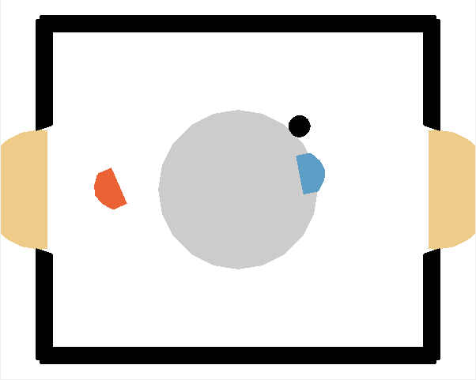

# Deep Reinforcement Learning for Air Hockey: A Rainbow DQN Approach with Component Ablation Analysis

This repository contains the implementation and experimental framework for studying Deep Q-Network (DQN) variants and Rainbow DQN in a physics-based air hockey environment. The codebase accompanies systematic ablation study analyzing the effectiveness of Rainbow DQN components in adversarial, low-dimensional continuous control settings.


## Repository Structure

```
hockey-env-dqn/
├── agents/
│   ├── __init__.py
│   ├── dqn.py              # DQN and Dueling DQN implementations
│   ├── rainbow.py          # Rainbow DQN implementation
│   └── replay_buffer.py    # Standard and Prioritized Experience Replay
├── hockey/
│   ├── __init__.py
│   └── hockey_env.py       # Air hockey environment (Box2D-based)
├── training/
│   ├── __init__.py
│   └── train.py            # Training loop and evaluation utilities
├── utils/
│   ├── __init__.py
│   └── visualization.py    # Plotting and analysis utilities
├── logs/                   # Training logs and checkpoints
├── results/                # Experiment results and summaries
├── figures/                # Generated figures for publication
├── assets/                 # Environment screenshots and media
├── run_experiments.py      # Main experiment runner
├── run_ablation_study.py   # Comprehensive ablation study script
├── Hockey-Env.ipynb        # Interactive environment demonstration
├── plots_for_report.ipynb  # Figure generation notebook
├── requirements.txt        # Python dependencies
├── setup.py                # Package installation script
└── README.md
```

## Quick Start with Pre-trained Model

Get started immediately using best-performing Rainbow agent trained for 200,000 episodes.

### Setup

```bash
# Clone and install
git clone https://github.com/lalit3c/RainbowDQN-AirHockey.git
cd RainbowDQN-AirHockey
pip install -r requirements.txt
```

### Load and Test Pre-trained Agent

```python
import numpy as np
import torch
import json
from agents.rainbow import RainbowAgent
import hockey.hockey_env as h_env

# Path to trained model
model_path = "logs/Rainbow_no_noisy_20260222_011934/best_model.pt"
config_path = "logs/Rainbow_no_noisy_20260222_011934/config.json"

# Load configuration
with open(config_path, 'r') as f:
    saved_config = json.load(f)

# Load checkpoint
device = torch.device("cuda" if torch.cuda.is_available() else "cpu")
checkpoint = torch.load(model_path, map_location=device, weights_only=False)
model_config = checkpoint['config']

# Create agent with saved configuration
rainbow_agent = RainbowAgent(
    state_dim=model_config['state_dim'],
    action_dim=model_config['action_dim'],
    hidden_dims=tuple(saved_config['hidden_dims']),
    n_step=model_config['n_step'],
    num_atoms=model_config['num_atoms'],
    v_min=model_config['v_min'],
    v_max=model_config['v_max'],
    noisy=model_config['noisy'],
    device="auto"
)

# Load trained weights
rainbow_agent.online_network.load_state_dict(checkpoint['online_network_state_dict'])
rainbow_agent.target_network.load_state_dict(checkpoint['target_network_state_dict'])

print(f"Model loaded successfully!")
print(f"Training steps: {checkpoint.get('step_count', 'N/A'):,}")
```

### Play Against Weak Opponent

```python
# Create environment
env = h_env.HockeyEnv()
player1 = rainbow_agent  # Trained agent
player2 = h_env.BasicOpponent(weak=True)  # Weak opponent

# Run evaluation
num_episodes = 20
winners = []
rewards = []

print(f"Testing against weak opponent...")

for episode in range(num_episodes):
    obs, info = env.reset()
    obs_agent2 = env.obs_agent_two()
    episode_reward = 0
    
    for step in range(251):
        a1 = env.discrete_to_continous_action(
            player1.select_action(obs, training=False)
        )
        a2 = player2.act(obs_agent2)
        
        obs, r, d, t, info = env.step(np.hstack([a1, a2]))
        obs_agent2 = env.obs_agent_two()
        episode_reward += r
        
        if d or t:
            break
    
    winners.append(info['winner'])
    rewards.append(episode_reward)

# Results
wins = sum(1 for w in winners if w == 1)
losses = sum(1 for w in winners if w == -1)
draws = sum(1 for w in winners if w == 0)

env.close()
```
    


## Environment Description

The Hockey environment simulates a two-player air hockey game implemented using the Box2D physics engine. The simulation runs at 50 FPS with a maximum episode length of 250 timesteps.

### State Space

The observation space is an 18-dimensional continuous vector:

| Dimensions | Description |
|------------|-------------|
| 0-5 | Player 1: position (x, y), angle, velocities (vx, vy), angular velocity |
| 6-11 | Player 2: position (x, y), angle, velocities (vx, vy), angular velocity |
| 12-15 | Puck: position (x, y), velocities (vx, vy) |
| 16-17 | Puck possession timers for both players |

### Action Space

The continuous action space is discretized into 8 actions:

| Action | Description |
|--------|-------------|
| 0 | No movement |
| 1-4 | Cardinal movements (up, down, left, right) |
| 5-6 | Angle rotation |
| 7 | Shoot |

### Reward Structure

- +10 for scoring a goal (winning)
- -10 for conceding a goal (losing)
- 0 for a draw (timeout)
- Additional reward shaping based on defensive positioning

### Opponents

Two built-in rule-based opponents are provided:
- **Weak Opponent**: Basic rule-based agent with limited responsiveness
- **Strong Opponent**: Improved agent with better puck tracking and shooting

## Implemented Algorithms

### DQN Variants

1. **Standard DQN**: Vanilla DQN with target network and experience replay
2. **Double DQN**: Addresses overestimation bias via decoupled action selection
3. **Dueling DQN**: Separates state value and advantage estimation
4. **Double-Dueling DQN**: Combines both improvements

### Rainbow DQN

Full Rainbow implementation integrating six components:

1. **Double Q-learning**: Reduces overestimation bias
2. **Prioritized Experience Replay (PER)**: Samples important transitions more frequently using a Sum Tree data structure
3. **Dueling Networks**: Decomposes Q-values into value and advantage streams
4. **Multi-step Learning**: Uses n-step returns for improved credit assignment
5. **Distributional RL (C51)**: Models the full return distribution using 51 atoms
6. **Noisy Networks**: Parametric exploration via noise injection (optional)

### Network Architecture

```
Input (18) -> Linear(256) -> ReLU -> [Dueling Split]
                                      |
                    +-----------------+------------------+
                    |                                    |
            Value Stream                         Advantage Stream
            Linear(256) -> ReLU                  Linear(256) -> ReLU
            Linear(num_atoms)                    Linear(actions * num_atoms)
                    |                                    |
                    +----------------+-------------------+
                                     |
                              Dueling Combine
                                     |
                              Softmax (C51)
```

## Usage

### Training a DQN Agent

```python
from training.train import train, TrainingConfig

config = TrainingConfig(
    agent_type="dqn",
    experiment_name="DQN_experiment",
    num_episodes=10000,
    double_dqn=True,
    dueling=True,
    weak_opponent=True
)

agent, logger = train(config)
```

### Training a Rainbow Agent

```python
config = TrainingConfig(
    agent_type="rainbow",
    experiment_name="Rainbow_experiment",
    num_episodes=200000,
    n_step=3,
    noisy=False,  # Recommended: disable Noisy Networks
    mixed_opponents=True,
    opponent_mix_strategy="alternate"
)

agent, logger = train(config)
```

### Evaluating a Trained Agent

```python
from training.train import evaluate_agent
from hockey.hockey_env import HockeyEnv_BasicOpponent, Mode

env = HockeyEnv_BasicOpponent(mode=Mode.NORMAL, weak_opponent=False)
avg_reward, win_rate = evaluate_agent(agent, env, num_episodes=100)
print(f"Win Rate: {win_rate:.2%}, Average Reward: {avg_reward:.2f}")
```

### Loading a Checkpoint

```python
from agents.rainbow import RainbowAgent

agent = RainbowAgent(state_dim=18, action_dim=8, noisy=False)
agent.load("logs/Rainbow_no_noisy_20260215_232022/best_model.pt")
```

## Reproducing Experiments

### Running the Full Ablation Study

```bash
python run_ablation_study.py --num_episodes 10000 --eval_episodes 50
```

This executes ablations across:
- Agent architectures (DQN variants vs Rainbow)
- Rainbow component removal (Noisy Networks, Multi-step)
- Opponent training strategies (weak-only, strong-only, alternate, random, curriculum)

### Running Extended Training

```bash
python run_experiments.py --experiment rainbow_not_noisy --episodes 200000 
```

### Generating Figures

The `plots_for_report.ipynb` notebook contains code for generating all publication figures from saved experiment logs.


## Hyperparameters

| Parameter | Value |
|-----------|-------|
| Learning rate | 6.25e-5 |
| Adam epsilon | 1.5e-4 |
| Discount factor (gamma) | 0.99 |
| Batch size | 32 |
| Replay buffer size | 100,000 |
| Target update (hard) | Every 8,000 steps |
| Soft update (tau) | 0.005 |
| Update frequency | Every 4 steps |
| N-step returns | 3 |
| Number of atoms (C51) | 51 |
| V_min, V_max | -10.0, 10.0 |
| PER alpha | 0.5 |
| PER beta (start) | 0.4 |
| PER beta annealing | 100,000 frames |
| Hidden dimensions | (256, 256) |
| Gradient clipping | Max norm 10.0 |


